# Paws on Heart Animal Shelter

<h2 align="left">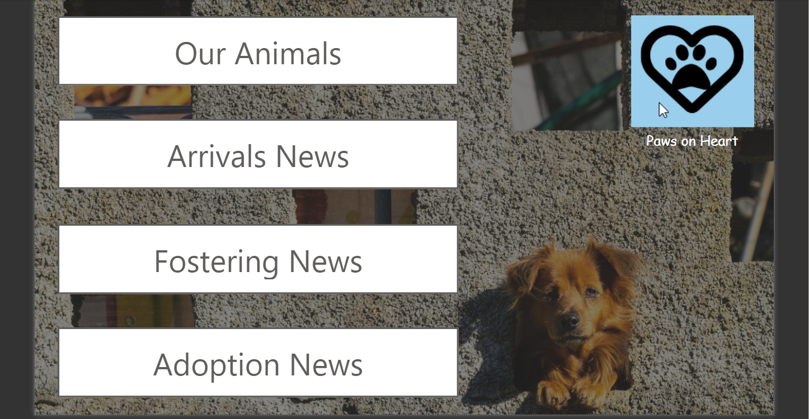</h2>

[View the video demo on YouTube](https://www.youtube.com/watch?v=ksAsAssvfhA)

## Power Up Challenge overview

Requirements for successful completion of the [**Microsoft Power Up Program**](https://powerup.microsoft.com/):
  
Applied knowledge and skills acquired during this course which spanned across
 
- Dataverse
- Power Apps (Model driven apps & Canvas apps)
- Power Automate cloud flows
- Power BI reports

  
## Business Scenario (Animal Shelter)
Paws on Heart is an animal rescue charity that operates animal shelters and liaises with local families to foster animals in need. 
The goal is to help every pet to get the veterinary care they need and to find their foster families.
Project addresses these requirements using Microsoft Power Platform to streamline the operations of this organisation.
  
The organisation aims to:
  

- Improve record-keeping on animals staying at their shelters and foster homes
- Make it easier for foster families to provide support
- Provide the social media team with insightful reports to help them encourage more people to foster a pet
 
  
## The Requirements
*High-level use-cases*:
 
1. Create Dataverse tables and load provided data in Dataverse 
2. Create a model driven app listing all the animals in the shelter and their details 
3. Create a canvas app listing all animals available for fostering and their details 
4. Send Power Automate notification containing fostering process details 
5. Create a Power BI data visualisation dashboard
  

### Dataverse:
 
1. Create Dataverse tables and load provided data in Dataverse 
Persona: Shelter Staff 
Use case: to effectively manage all shelter data in one place 

- Import all the provided data from the Power Up Challenge resources into the Dataverse:
  - Animal data
  - Shelter locations
  - Foster family information

  

### Model-driven app:
 
2. Create a model driven app listing all the animals in the shelter and their details 
Persona: Shelter Staff 
Use case: to effectively manage all shelter operations 

- View a list of animals displaying name, type, shelter status and shelter name
- Ability to sort and filter the animal list by type of animal, by shelter status and by shelter name
- Ability to select an animal and see animal details such as name, type, age,sex, shelter status, location, medicalissues, upcoming veterinary appointment
- Ability to update the details for an animal such as medical issues veterinary information and mark an animal as “ready to foster” once they have passed their medical requirements.

  

### Canvas app:
 
3. Create a canvas app listing all animals, available for fostering, and their details 
Persona: Foster Family 
Use case: to facilitate choosing an animal to foster 

- Select a local shelter name
- View a list of animals at the selected local shelter that are ready to be fostered, featuring name, type, age, picture, and any medical conditions
- Ability to select an animal, enter foster family information and update the status to "claimed for foster“ on click of a button and the family that the animal is associated with

  

### Power Automate:
 
4. Send Power Automate notification containing fostering process details 
Persona: Foster family 
Use case: to advise the foster family on next steps 

- When an animal’s status changes to ‘claimed for foster’, send a notification email to the foster family indicating details associated with the animal and a date to arrange to come and pick up the animal.

  

### Power BI
 
5. Create a Power BI data visualisation report 
Persona: Marketing Team 
Use case: to showcase shelter accomplishments 

- Latest News (In last 1 months)
  - Number of pets who arrived at the shelter
  - Number of pets that were fostered
- Trends (In last 3 months)
  - Most rescued type of animal
  - Most fostered type of animal

  
<h2 align="left">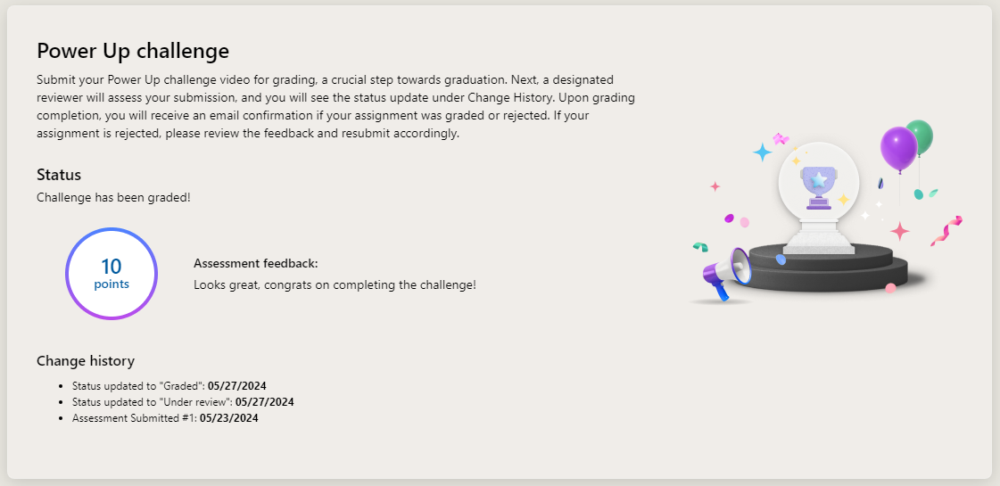</h2>

## Animal Shelter Solution

<h2 align="left">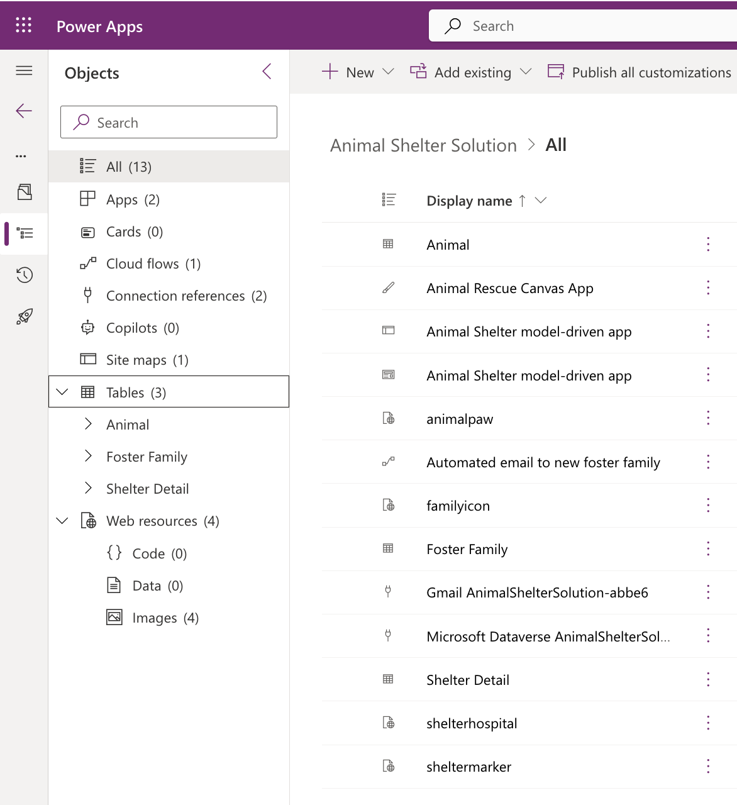</h2>

### Model Driven App
#### Shelter Details View
<h2 align="left">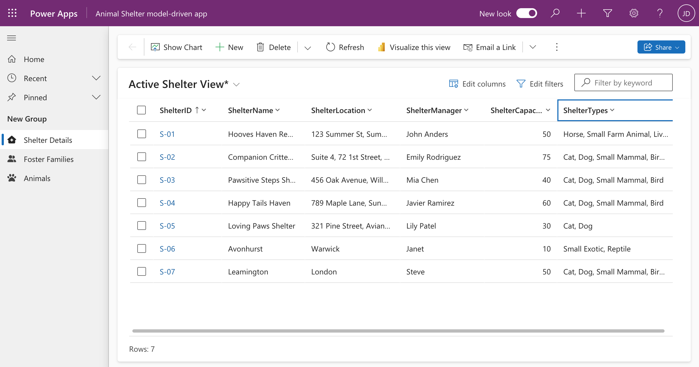</h2>
  
* Inbuilt BI report
  <h2 align="left">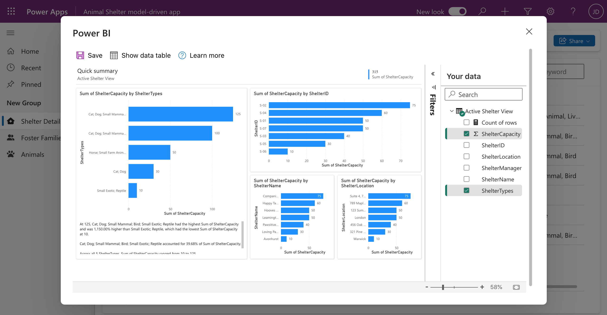</h2>

* Add a new record
  <h2 align="left">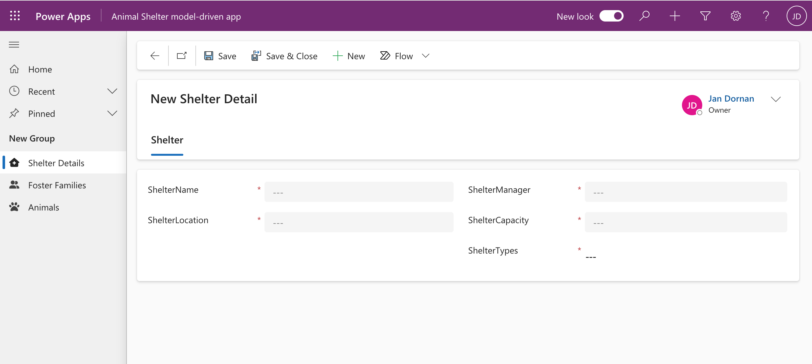</h2>

  
#### Foster Familes view
<h2 align="left">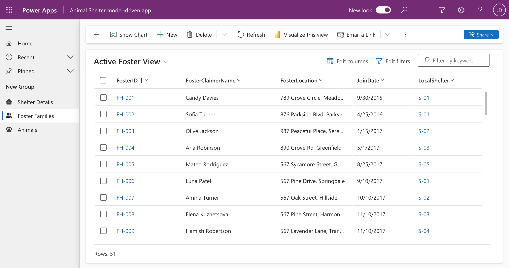</h2>
  
* Inbuilt BI report
  <h2 align="left">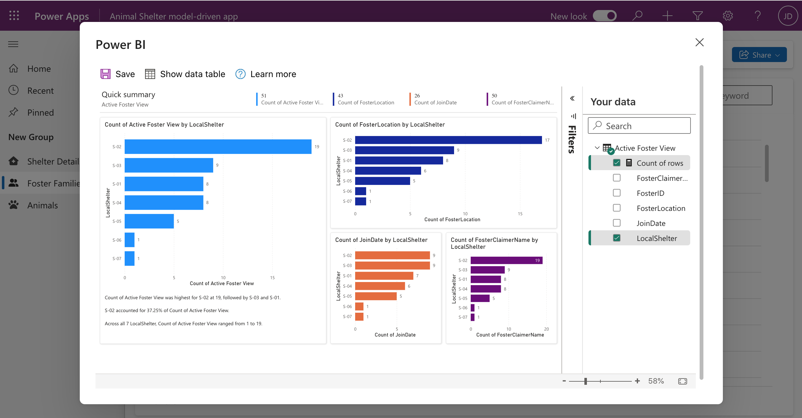</h2>

* Add a new record
  <h2 align="left">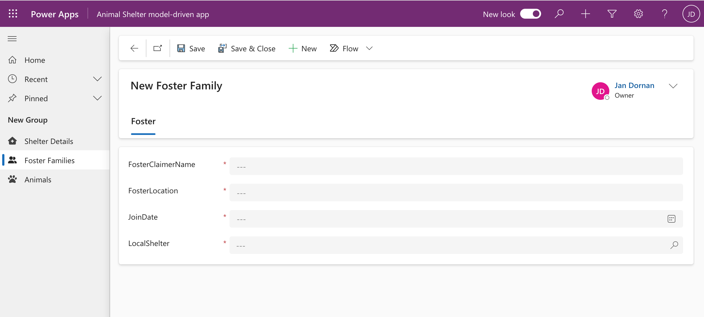</h2>

  
#### Animals view
  <h2 align="left">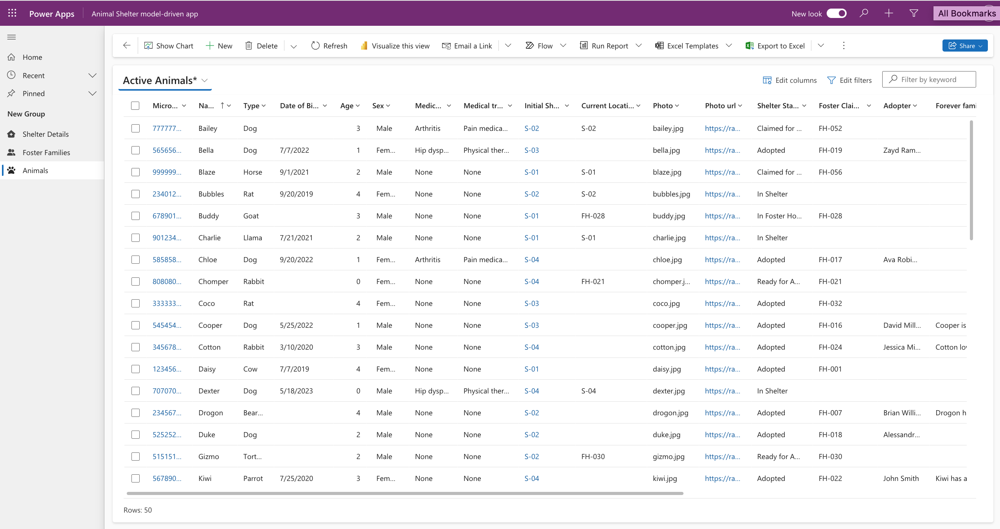</h2>
  
* Inbuilt BI report
  <h2 align="left">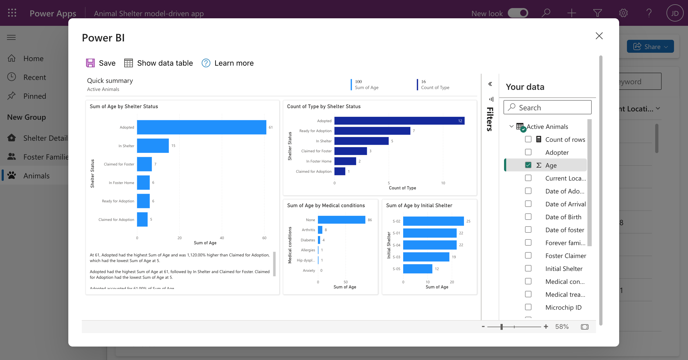</h2>
  
* Add a new record  
  <h2 align="left">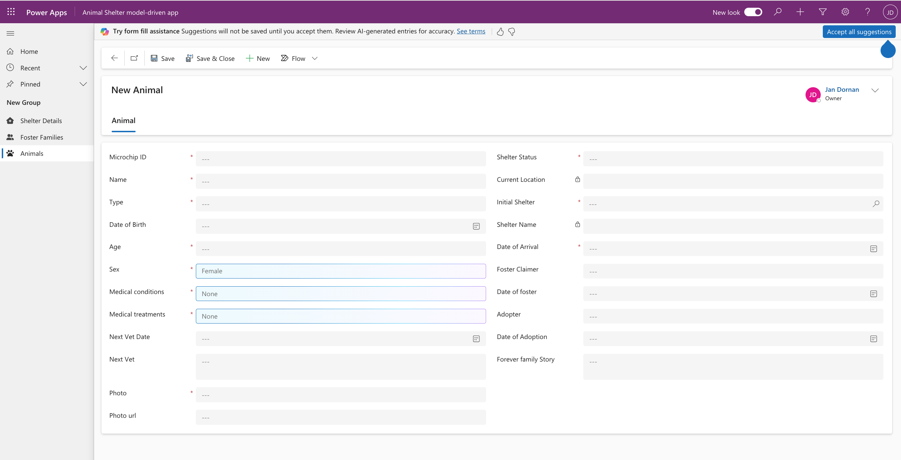</h2>

  Using a lookup
  <h2 align="left">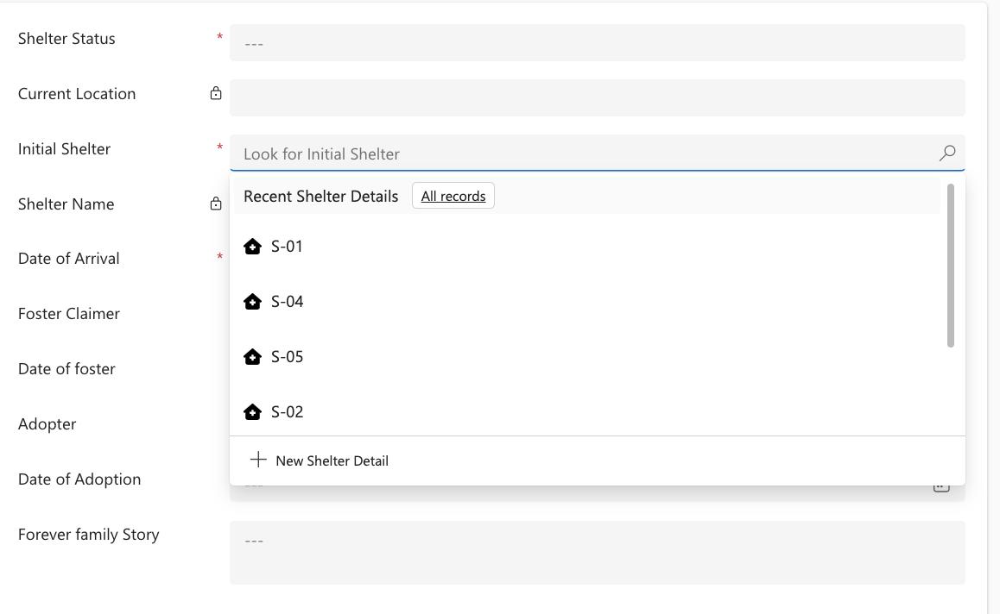</h2>

### Canvas App (Mobile)
#### Home Screen
  <h2 align="left">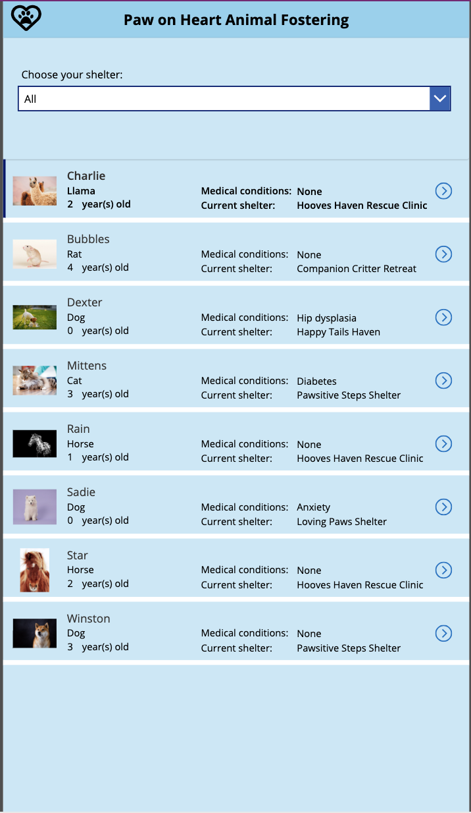</h2>

  Select a shelter
  <h2 align="left">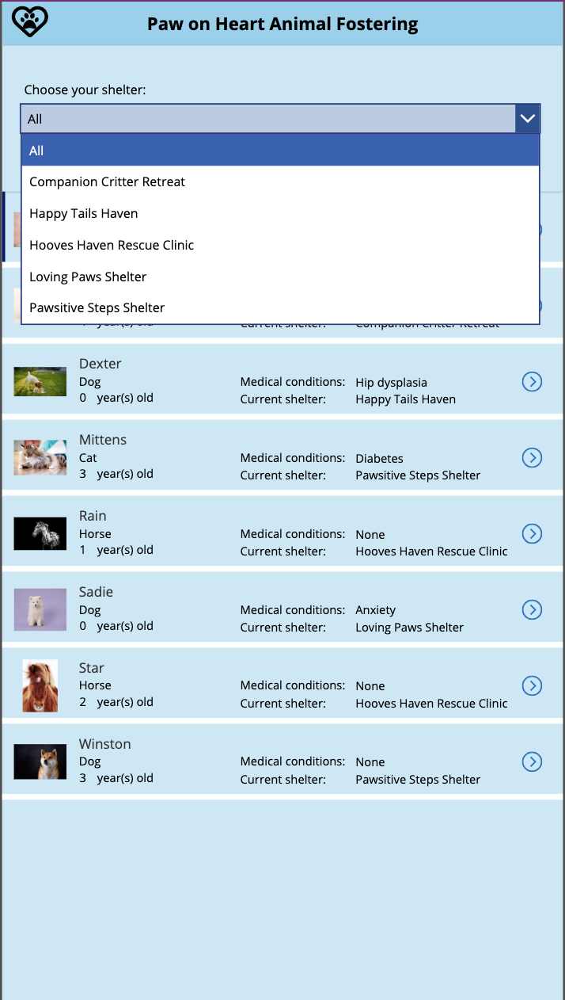</h2>

  Selection is filtered
  <h2 align="left">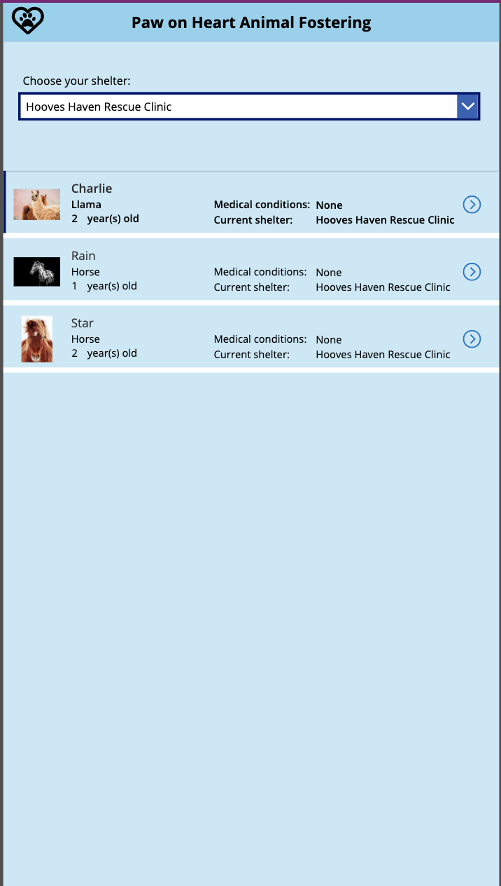</h2>
  
####  Detail Screen
  <h2 align="left">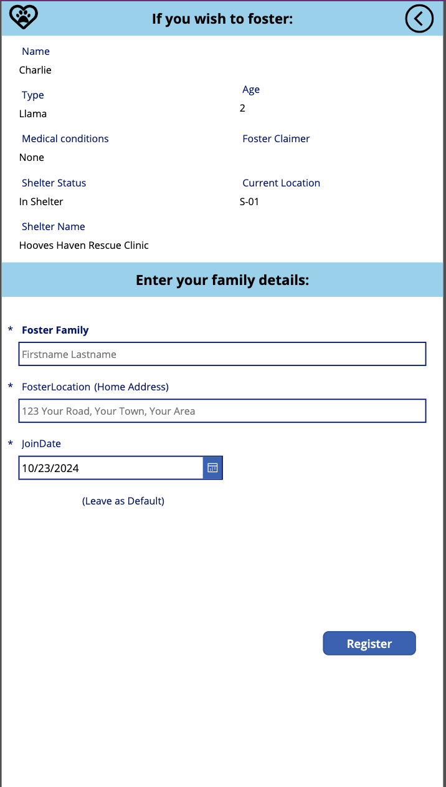</h2>

